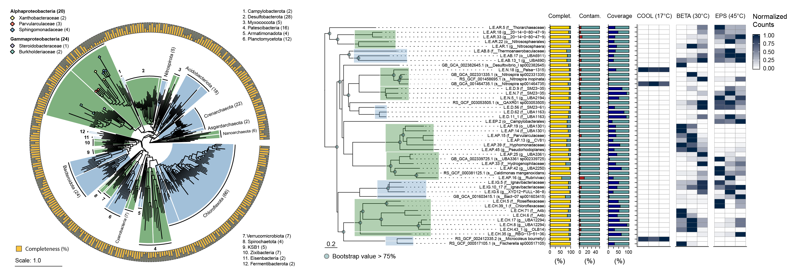

# Visualization of Metagenomic and Metatranscriptomic Data in R | ECOSCOPE

## Overview

Metagenomics and metatranscriptomics offer unparalleled insight into the taxonomic and functional diversity present across a multitude of environments. Yet the vast amounts of data these tools produce is challenging to effectively analyze and visualize.

We will analyze a unique thermal swamp metagenome and metatranscriptome dataset to develop strategies for effective visual communication.

This workshop is designed around the application of whole-genome phylogenetic analysis to organize the diverse data types that we can generate from metagenomics and metatranscriptomics analysis. 

You will learn: 

1. Manipulating and visualizing whole-genome phylogenies with <i>ggtree</i> 
2. Mapping genome assembly statistics to phylogenetic trees with <i>ggplot2</i>
3. Processing count data from <i>Meiji</i> and mapping to phylogenetic trees
4. Genomic functional annotation and pathway analysis with <i>pathview</i>
5. Mapping metatranscriptomic count data and coverage to circular genome maps with <i>circlize</i>
6. Bonus: Mapping metatranscriptomic count data and coverage to linear contig maps

This workshop assumes some prior experience with R (such as that in our [Introduction to R workshop](https://github.com/EDUCE-UBC/workshops_R/tree/master/intro_R_2hr)). All code presented in this workshop is contained in the “metagenomics.R” R script file. 

You can follow along with the workshop by selecting the relevant line(s) of code and pressing ctrl+enter on Windows, cmd+enter on MacOS, or using the “Run” button in the upper right of your script window to execute it.

Note that the majority of this workshop uses base R functions. No experience with Tidyverse is required. 

Please call over the instructor or a TA if you have any problems with executing the code or if you need any help with the exercises. 

## Prior to the workshop

### Setup Instructions

Please come to the workshop with your laptop setup with the required software and data files as described in our setup instructions.
